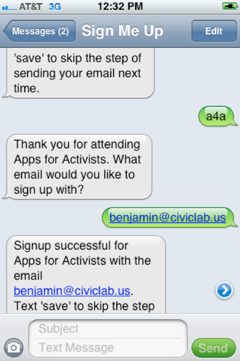

# Signmeup
### Paperless event signup built with Express, Mongoose, Handlbars and Twilio.

A while back I was a part of a short lived meet up called "Hacks for Hacktivists".  The idea behind this group was to create applications (software or hardware) that would ease certain friction poitns in the activist/community organizing process.  The idea behind this group came from my good friend, colleague, and co-founder of CivicLab, Tom Tresser.  

Tom is a long time Chicago community organizer whose main interests are in the protection of public goods from private interests.  Part of his model of organizing (built upon Saul Olinsky's model) is to gather grassroots support by visiting people all accross the city.  In his latest project, The TIF Illumination Project, Tom has presented in front of over 4000 people.  And, don't forget, this isn't the first time he's done this before.  Naturally, since community organizing is abou creating a community to press for change, Tom spends a lot of his time entering the names of those who sign-in to the presentations he gives.  Additionally, he often asks people to mark down whether or not they'd be interested in Along the way, Tom conceived of an idea for an application that would allow people to sign up via text.  Given the number of people organizing in this city, he also felt that there would be a large number who were suffering from the same problem.  Enter Signmeup.

This application is a proof of concept. Here's an over view of how it currently works given that the user doesn't encounter any problems (misspelling of event ID, for example).  Note, the application does provide feedback in the form of error and confirmation messages to the user (e.g. "Event ID not found, please try again").

1. The group/person (the "organization") collecting the sign-in's, goes to the URL /events/create/ and registers their event and as well as an event code.
2. The organization posts the code up all around their event along with the Twillio number.
3. At the event, users text the event code.
4. If the program already has your phone number and email saved from prior use, it will sind you a message that your signup has been successful.
5. If it does not have your contact information it will ask you for your email address.
6. After giving you a "success" message, it will ask you if you would like to save your information.
7. If yes, a second message will be sent letting the user know that they can remove their info from the database any time by texting "forget".
8. If they do, a message is sent saying that they have been removed.

###Setup

Sign up for Twillio, then fill in the config.js accordingly.

(Surely, this should be elaborated upon such that cloning and installing dependancies is a part of it, including signing up for Twillio.)

###To-do's:

- **Security** - This app has no security measures whatsoever, and in today's surveilance climate, the app is completely useless unless this can be addressed.  The very nature of the application requires users to be sending phone numbers and emails.  Securing this information presents two significant challenges.  First, the general security of the database.  Second, defense against any eavesdropping while the messages are in transit.

- **Organization/User registration and log in** - Organizations will want a profile so they can keep track of events and don't have to re-enter data all the time.  User's so they can manage their notification features and data permissions.

- **Terms of Service** - Since we're taking peoples' contact information, we'll need to maximize the privacy choices they can make.  In order for a user to make choices, they need to be informed about how the data is collected and used.  Perhaps an email is sent, and until you confirm the email, your info is not disclosed or saved in the database after a ceertain number of days.

- **Payment integration** - Twillio is not free.  Should this be developed into an application for public use (not a standalone library) inevitabilty you'll need to have people pay for it.  This could be as simple as a link guiding someone to a paypal/bitcoin system, afterwhich they obtain a confirmation link.

- **Simpler routing** - Right now all text interactions rely on a single URL route which then moves to a controller which does what would ordinarily be though of as routing.  This is because Twillio needs a single URL to interact with your application.  Instead, the application uses the cookie to keep track of state, and to send the message down the appropriate path.  This has lead to a bit of callback hell within the controller.  Surely there's a better way, and I imagine this includes refactoring the code into sepprate functions, or some sort of internal redirect (not an actually HTTP redirect which I think would cause a message to be sent back to Twillio each time).

- **Greater flow control**  As it stands, you can only walk forwards through the application.  If you enter an incorrect email, there is no equivalent of "If this is correct, press one."

- **Event lists** - As long as organizations are entereing there events, we might as well have a *very simple* listing of all events registere.  Users could then download the event via calendar protocal, or signup for reminders, etc.

- **Organization lists** - In the same vein as the above, there might as well be a *very simple* list of the organizations that have events rigistered whcould would allow people to sign up for their notifications.

- **Event data** - More information coleection about the event beyond the title, date, time, description, perhaps.

- **List download** - The ability for the organization to download the list after the event.

- **Tests** - this code does not have any unit tests nor has it been tested in the field in groups over 10 people.

###Future directions

At one time, it seemed like a good idea to leverage the fact that we'd also have data about events, users, and organizations into an events calendar, along with some analytics.  Larger features such as this, and perhaps even this very app have been implemented in programs such as Nation Builder.  As such, I'm not sure this application is worth developmenent except as a library made for an open source alternative to Nation Builder.  Or, as a stand alone app for those who want this function and nothing more.

Also, while cell phones and smart phones have been vastly adopted, not everyone will have one, nor be inclined to use theirs, so you'll have to have a backup system.  You could create a local network and bring your own cell phones which would be an interesting project, too.  This brings up another drawbrack which is that passing around a sign-in sheet comes with a cultural expectation that you will sign-up.  Allowing people to use their own cell phones give them the anonymity to not sign-up.  Personally, that's what I would do.